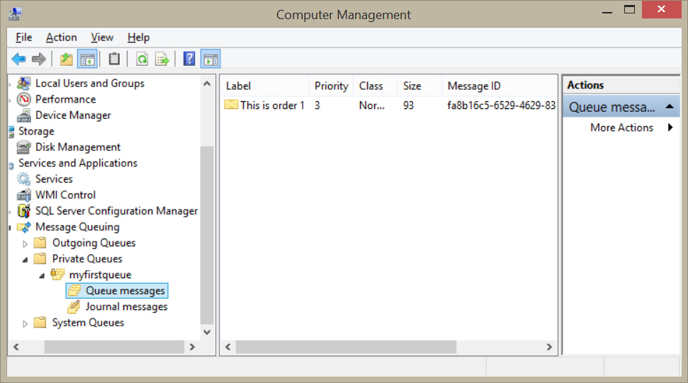
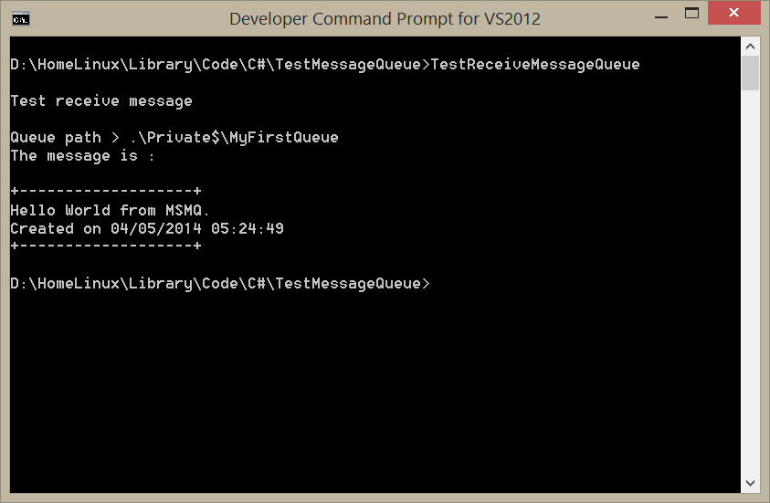

# Utilizando Message Queue con C# en .NET Parte II

Continuando con el tema de Microsoft Message Queue, mostraré como recibir un mensaje almacenado en la cola de espera. En la primera parte de este tutorial enviamos un mensaje a una cola de espera por lo que ahora hare un programa que utilice el método Receive() de la clase MessageQueueHelper que puse de ejemplo en la primera parte de este tutorial para obtener ese mensaje y mostrarlo.

 

Hay que recordar que MSMQ trabaja con un principio <b>FIFO (First In, First Out)</b> lo que significa que el primer mensaje en la cola es el mensaje que recuperarás utilizando los métodos <i>Receive()</i> o <i>Peek()</i> de la clase <a href="http://msdn.microsoft.com/en-us/library/system.messaging.messagequeue.aspx">MessageQueue</a>.

Al ejecutar el programa se verá la siguiente salida:

 

Ahora voy a explicar cómo funcionan los métodos de la clase <b>MessageQueueHelper</b>.
El método <i>CreateQueue()</i> recibe tres parámetros que indican las siguientes propiedades:
<ol>
<li><b>Path:</b> Indica la ubicación de la cola de espera.</li>
<li><b>Transactional:</b> Especifica si la cola puede aceptar transacciones de mensajes.</li>
<li><b>Label:</b> El título que describe de la cola de espera.</li>
</ol>
Para el valor del Path, el “.” Indica que estamos creando la cola de espera en la maquina local y utilizamos el prefijo <i>Private$</i> para indicar que es una cola de espera privada, si omites este prefijo indica que la cola de mensajes es pública.

<pre>
 queue = MessageQueue.Create(queuePath,isTransactional);
 queue.Label = label;
</pre>

En el método <i>SendMessage()</i> utilizamos le asignamos la clase <b>XmlMessageFormatter</b> para dar un tipo de formato al mensaje. Los MessageFormatters implementan la interfaz IMessageFormatter, la cual puede ser aplicada a un mensaje o a toda la cola de espera. Es indispensable que utilices el mismo MessageFormatter tanto para enviar o para recibir el mensaje. Aquí una lista de los Formatters:
<ol>
<li><b>ActiveXMessageFormatter:</b> Se utiliza para trabajar con componentes COM.</li>
<li><b>BinaryMessageFormatter:</b> Utilizado para serializar o deserializar un mensaje en un formato binario.</li>
<li><b>XMLMessageFormatter:</b> El formatter predeterminado, serializa y deserializa en formato XML.</li>
</ol>
Aquí está el código donde se utiliza:

<pre>
 queue = new MessageQueue(queuePath);
 queue.Formatter = new XmlMessageFormatter();
</pre>

Por último en el método  <i>GetMessage()</i> igual que para enviar el mensaje utilizo una clase MessageFormatter para deserializar el mensaje, también utilizo el método <i>Receive()</i> de la clase <b>MessageQueue</b> para obtener el primer mensaje de la cola de forma síncrona, como argumento recibe un <b>TimeSpan</b> que representa el intervalo de tiempo de espera para recibir el mensaje, este argumento es importante o de lo contario si no se recibe el programa se bloqueara hasta que no haya recibido el mensaje.

<pre>
 queue = new MessageQueue(queuePath);
 queue.Formatter = new XmlMessageFormatter(new Type[]
 {
 Type.GetType("System.String")
 });
 queueMessage = queue.Receive(new TimeSpan(0,0,2));
 message = queueMessage.Body.ToString();
</pre>
